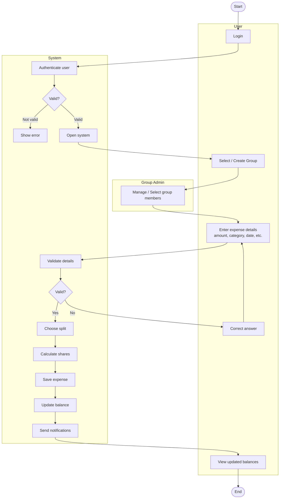

# Smart Expense Splitter & Tracker
**Group No:** 28 | **Lab Group:** 4

## 4. Activity Diagram

**Swimlanes:** User | Group Admin | System

### 4.1 Flow Description

1. **User** logs in.
2. **System** authenticates the user.
   - *Not valid* → System shows an error.
   - *Valid* → System opens the system.
3. **User** selects or creates a group.
4. **Group Admin** manages / selects group members.
5. **User** enters expense details (amount, category, date, etc.).
6. **System** validates the details.
   - *No* → User corrects the answer and re-enters details.
   - *Yes* → continue.
7. **System** lets the user choose the split, then calculates shares.
8. **System** saves the expense.
9. **System** updates balances.
10. **System** sends notifications.
11. **User** views the updated balances.
12. End.

### 4.2 Diagram (Mermaid)

### 4.3 Related Requirements

| Step | Requirement |
|---|---|
| Login / authenticate | FR-02 |
| Select/create group, manage members | FR-05, FR-13, DR-04 |
| Enter and validate expense | FR-03, DR-01, DR-02 |
| Choose split, calculate shares | FR-05, DR-03, DR-11 |
| Update balance | DR-06 |
| Send notifications | FR-08 |
